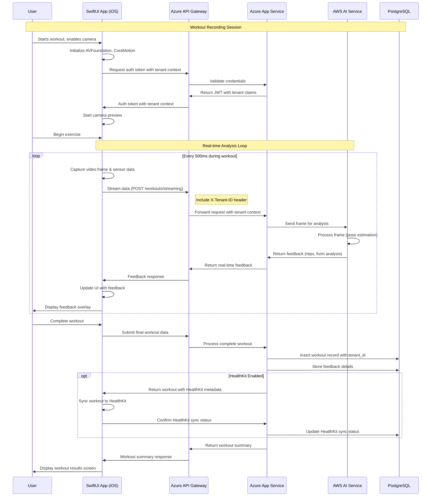

# Sequence Diagram: Workout Recording with Feedback

## Overview
This sequence diagram illustrates the flow of data and interactions between components during a workout recording session with real-time feedback.

## Actors and Components
- **User**: The end user of the iOS application
- **SwiftUI App (iOS)**: The client application built with SwiftUI
- **Azure API Gateway**: Centralized API management layer
- **Azure App Service**: Hosts the backend workout service
- **AWS AI Service**: Lambda functions and SageMaker for AI analysis
- **PostgreSQL**: Database for persistent storage

## Sequence Flow

## Key Implementation Notes

1. **Tenant Isolation**:
   - All requests include tenant context via the X-Tenant-ID header
   - Backend services enforce tenant isolation for all data operations
   - Database queries filter by tenant_id

2. **Real-time Processing**:
   - Video frames are streamed at regular intervals (optimized for performance)
   - Initial processing occurs on device for immediate feedback
   - Cloud AI provides enhanced analysis with lower latency requirements

3. **HealthKit Integration**:
   - Workout data is mapped to HealthKit workout types
   - Synchronization occurs after workout completion
   - Sync status is tracked for troubleshooting

4. **Error Handling** (not shown):
   - Network disruptions handled with local buffering
   - AI service failures gracefully degrade to basic functionality
   - All errors logged with correlation IDs for troubleshooting
